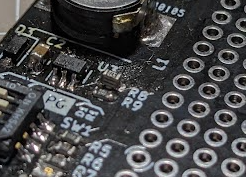

# 2024年全ロボ用名刺

## 自己紹介  

一応名刺なのでまずは自己紹介から…。
豊田高専でロボコンをしておりますさばねっこと申します。  

2021/2022は豊田高専Aチームの回路班長としてロボコンに参加し、モタドラとか電源とかパワー系の回路をいろいろやってました。  

  
↑2022高専ロボコンの時のやつ。  

また2023の学生ロボコンにも豊田高専RoboSharpとして参加させていただきました。  

普段は趣味の電子工作をネットに垂れ流す遊びをしているので良かったら見ていってください。自作モーターとかテスラコイルとか~~コイルガン~~(検閲済み)とかいろいろやってます。  

[Twitter(X)](https://twitter.com/sabanekko1)  
[blog](https://sabanekko2.hatenablog.com/)  

もし何かあれば気軽にDMくださいね！  

## 基板概要  

この名刺は簡単に言えば †僕が考えた最強のユニバーサル基板† となっております。  
主な特徴として、

- USB type-Cポート  
- シリアル変換IC搭載
- USB-PDトリガー搭載
- 3.3V600mAのスイッチングレギュレータ搭載
- GND用ベタプレーン
- ターミナルブロックがそのまま挿せる穴径
  
があります。便利ですねー。  

  

回路図は[こちら](2024_namecard.pdf)  

## 作り方  

基本的には下に示した部品リストの部品を乗せて頂ければよいのですが、PDトリガーICのCH224Kに関してはIC裏面にGNDパッドがあるため頑張らないといけません。  

はんだ付けの流れの例を示します。  

まず、ソルダーペーストと爪楊枝を用意します。  

  

爪楊枝でいい感じの量のペーストを取って基板に塗ります。  
量はそれほど多く無くてかまいません。また、ICの足は後からはんだごてではんだ付けすればいいだけなので塗っても塗らなくても大丈夫です。  

いつか塗り方の例の写真追加します…。  

ペーストを塗ったらICを乗せて…

  

ヒートガン等で炙ります。  
ガス式のはんだごて等があると便利なのでおすすめ。  

  

しばらく炙ればこんな感じではんだ付け完了です。  

  

仕上げに普通のはんだごてで余分なはんだを取り除いて、浮いている足があればはんだ付けしましょう。  

### 部品リスト  

寸法は全てmetric

||部品|備考|リンク|
|:--:|:--:|:--:|:--:|
|C1|0.1uF 1608|CH340Eパスコン||
|C2|4.7uF以上 2012|スイッチングレギュレータ入力||
|C3|1.0uF 2012|CH224K 電源||
|C4~C6|22uF以上 3216|スイッチングレギュレータ出力||
|D1|LED 1608|CH340E TNOW||
|D2|LED 1608|CH224K PG||
|D3|ショットキー SOD-123|スイッチングレギュレータ出力|https://akizukidenshi.com/catalog/g/gI-02074/|
|F1|ポリヒューズ 2012|脳死で選んでた|https://akizukidenshi.com/catalog/g/gP-13955/　←耐圧低いのでヤバいです|
|J1|USB type-C||https://akizukidenshi.com/catalog/g/gC-14356/|
|L1|47uH||https://akizukidenshi.com/catalog/g/gP-08322/|
|R1,R2|4.7kぐらい 1608|LEDの抵抗なので適当||
|R3,R5,R6,R7|10k 1608|||
|R8|56k 1608|電圧フィードバック||
|R9|33k 1608|電圧フィードバック||
|SW1|DIP SW|PD電圧設定|https://akizukidenshi.com/catalog/g/gP-08929/|
|U1|CH340E|シリアル変換|https://akizukidenshi.com/catalog/g/gI-13543/|
|U2|CH224K|電圧フィードバック|https://akizukidenshi.com/catalog/g/gI-18023/|
|U3|NJW1933|スイッチングレギュレータ|https://akizukidenshi.com/catalog/g/gI-15944/|

なおR8,R9は電圧フィードバック用の分圧抵抗なので  
$$
1.245[V]\cong\frac{R9}{R8+R9}\times 3.3[V]
$$
になるような抵抗になっていれば何でもいいです。  
私は手持ちの抵抗が無かったのでR9=1k,R8=4.7k 3並列とかいう違法建築を敢行しました。  

  

## 使い方  

### USB-PD

**0がON,1がOFFです！！！　設計ミスった！！！！！**

|出力電圧|DIP1|DIP2|DIP3|DIP4|
|:--:|:--:|:--:|:--:|:--:|
|5V|1|-|-|-|
|9V|0|0|0|-|
|12V|0|0|1|-|
|15V|0|1|1|-|
|20V|0|1|0|-|

問題なく電圧が出力されていればD1(PG)が光ります。  
A to Cケーブルを使用している場合D1は光りません。  

### USB-Serial変換  

CH340Eを乗せているのでUSBをパソコンにつなげるだけで使えます。  
通信中はD2が光ります。  
上手く通信できない場合はドライバが必要かも…？  

### GNDスルーホール  

基板外周のスルーホールは全てGNDに繋がっています。  
電源配線にご利用ください。  

### 機能付きスルーホール  

特定の機能が付与されたスルーホールが設定されています。  

  

#### BUS-POWER

USBのVBUSと接続されています。  
USB-PDで取り出した電圧をそのまま受け取ることができます。  

#### 3.3V

スイッチングレギュレータで生成された3.3Vを引き出せます。  
最大500mAを目安にしてください。  

#### UART-TX/RX

シリアル変換ICと接続されてます。  
TXにデータを入力、RXからデータを受け取ることができます。  
